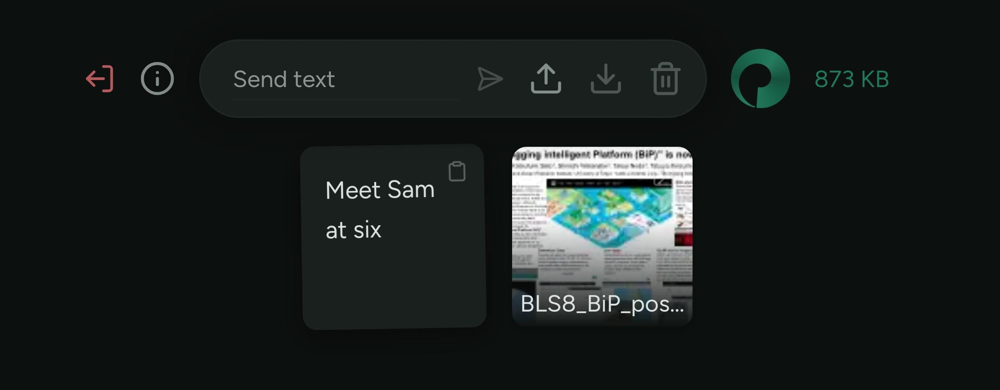

# Shelf

A website for sending things to yourself.

## What is Shelf?

Ever needed a sentence moved from your phone to your laptop? How about a file?

Shelf is a personal transfer tool for moving stuff between your devices. You can send yourself anything, including reminders, photos, links, and long OTPs.



## Features

- Text and file transfers with drag-and-drop, paste, and upload.
- Send text directly from the toolbar.
- Multi-user with per-user passwords.
- Thumbnails for images, PDFs, and SVGs.
- Lasso selection and full keyboard shortcuts (press `?` in-app).
- Mobile UI with paste, upload, download, and delete.
- 1GB file upload limit.

## Tech stack

- **Frontend**: React 19, Zustand, Tailwind CSS v4, Vite.
- **Backend**: Litestar (Python), SQLAlchemy, SQLite.

## Getting started

Requires **Python 3.12+** and **Node 20+**.

```bash
python -m venv .venv
source .venv/bin/activate   # Windows: .venv\Scripts\activate
pip install -e .
shelf-install
shelf-start
```

`shelf-install` creates a dev user with password `test`. The dev server proxies `/api` requests to the backend at `localhost:8000`.

### Development scripts

Shelf includes cross-platform development scripts, installed via `pip install -e .`. Run `shelf-help` for a quick reference.

| Command | Description |
|---------|-------------|
| `shelf-install` | Set up API venv, npm install, and create dev user |
| `shelf-start` | Start API and frontend dev servers |
| `shelf-stop` | Stop running services by port |
| `shelf-test` | Run all tests (unit + e2e) |
| `shelf-test unit` | Run API and frontend unit tests only |
| `shelf-test e2e` | Start test services and run Playwright e2e tests |
| `shelf-test e2e --headed` | Run e2e tests with a visible browser |
| `shelf-adduser` | Create a new user (pass password as arg or interactive) |
| `shelf-clean` | Remove all generated files (preserves root .venv) |
| `shelf-help` | Show available commands |

### Test mode

Set `SHELF_TEST=1` in a `.env` file at the project root to run Shelf in test mode. This uses an isolated database in a temp directory and separate ports (9000/9001), so it won't interfere with your real data or a running dev instance. A test user with password `test` is created automatically.

Remove `SHELF_TEST=1` and restart to return to normal mode.

### Testing

`shelf-test` runs all test suites. Use `shelf-test unit` to run only API and frontend unit tests (no services needed), or `shelf-test e2e` to start test mode services and run Playwright end-to-end tests. The e2e runner manages its own service lifecycle — it starts, tests, and shuts down automatically.

## API reference

### Auth

| Method | Endpoint | Description |
|--------|----------|-------------|
| `POST` | `/auth/login` | Login with password |
| `POST` | `/auth/logout` | End session |
| `POST` | `/auth/change-password` | Change password |
| `GET` | `/auth/check` | Check auth status |
| `POST` | `/auth/api-keys` | Create API key |
| `GET` | `/auth/api-keys` | List API keys |
| `DELETE` | `/auth/api-keys/:id` | Revoke API key |

### Transfers

| Method | Endpoint | Description |
|--------|----------|-------------|
| `GET` | `/transfers` | List all transfers |
| `POST` | `/transfers` | Create text transfer |
| `POST` | `/transfers/upload` | Upload file |
| `GET` | `/transfers/:id/download` | Download file |
| `GET` | `/transfers/:id/thumbnail` | Get thumbnail |
| `PATCH` | `/transfers/:id` | Rename transfer |
| `DELETE` | `/transfers/:id` | Delete transfer |
| `POST` | `/transfers/batch-delete` | Delete multiple |
| `POST` | `/transfers/batch-download` | Download as ZIP |
| `GET` | `/transfers/usage` | Storage usage |

### Other

| Method | Endpoint | Description |
|--------|----------|-------------|
| `GET` | `/stats` | Request counts per route |
| `GET` | `/health` | Health check |

## Feedback

[Open an issue](https://github.com/MutantCacti/shelf/issues/new) on GitHub.
